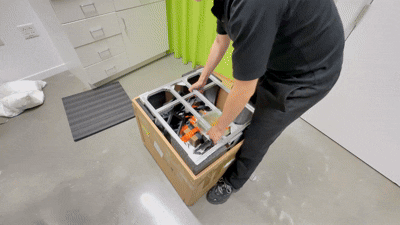
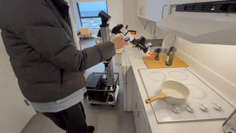

<div style="margin-bottom: 1.2em;">
  <h1 align="center" style="font-size: 3em; margin: 0 0 0.15em 0;">Simple Mobile</h1>
  <p align="center" style="margin: 0; font-size: 1.05em; color: #555;">
  <a href="https://haoyu-x.github.io/"><strong>Haoyu Xiong</strong></a> - MIT CSAIL
  </p>
  <div style="width: 80px; height: 1px; background-color: #ccc; margin: 0.8em auto 0 auto;"></div>
</div>


## Motivation
**Simple Mobile** is a tutorial for setting up a mobile bimanual robot for research with ``minimal effort``.

Hardware setup can be tedious, **Simple Mobile** is designed to make the process easier. With support from hardware vendors, you can now purchase an <a href="/hardware">out-of-box hardware kit</a> directly, without having to build everything from scratch. We also provide a *plug-and-play*  codebase for the robot control, teleoperation, data collection, model training, and inference. 

**Simple Mobile** aims to make mobile manipulators more accessible, save you time, and help you get to the ``research part`` faster.


<div align="center" style="display: flex; justify-content: center; align-items: center; gap: 16px; margin: 1.5em 0;">
  
  
</div>

## Table of Contents
This tutorial walks you through hardware setup, data collection, training a diffusion policy, and deploying the model on the robot.

📚 <a href="https://haoyu-x.github.io/simple-mobile/">Tutorial Page/a> 

🛠️ <a href="/hardware">Hardware Guide</a> 

🎮 <a href="/simple_mobile">Teleop & Data Collection</a> 

📍 <a href="/diffusion_policy#policy-training">Model Training</a>

🤖 <a href="/inference">Inference & Deployment</a>

## Acknowledgment
The code is adapted from <a href="https://tidybot2.github.io/">TidyBot++</a>, <a href="https://pyroki-toolkit.github.io/">PyRoki</a> and the design draws inspiration from [Vision in Action](https://vision-in-action.github.io/), [Tidybot++](https://tidybot2.github.io/), [CMU Door Opening Project](https://open-world-mobilemanip.github.io/).

Please consider citing these papers if you find this tutorial helpful:
```bibtex
@article{xiong2025via,
  title = {Vision in Action: Learning Active Perception from Human Demonstrations},
  author = {Haoyu Xiong and Xiaomeng Xu and Jimmy Wu and Yifan Hou and Jeannette Bohg and Shuran Song},
  journal = {arXiv preprint arXiv:2506.15666},
  year = {2025}
}

@inproceedings{wu2024tidybot,
  title = {TidyBot++: An Open-Source Holonomic Mobile Manipulator for Robot Learning},
  author = {Wu, Jimmy and Chong, William and Holmberg, Robert and Prasad, Aaditya and Gao, Yihuai and Khatib, Oussama and Song, Shuran and Rusinkiewicz, Szymon and Bohg, Jeannette},
  booktitle = {Conference on Robot Learning},
  year = {2024}
}

@article{xiong2024adaptive,
  title={Adaptive Mobile Manipulation for Articulated Objects In the Open World},
  author={Xiong, Haoyu and Mendonca, Russell and Shaw, Kenneth and Pathak, Deepak},
  journal={arXiv preprint arXiv:2401.14403},
  year={2024}
}
```
