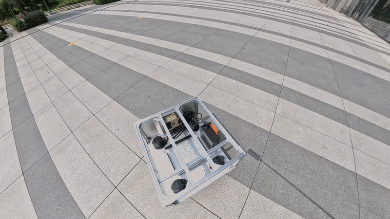
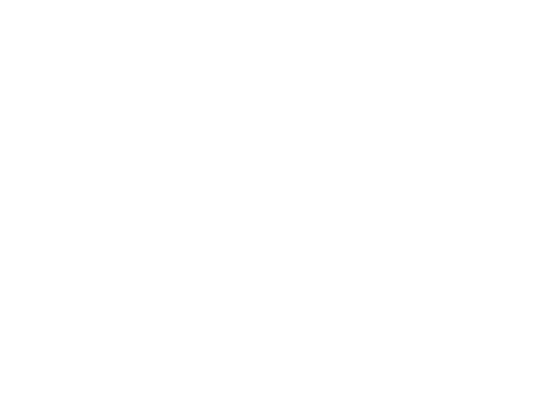
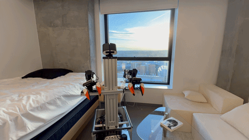

## Design Choices

To keep the system simple, we mount two low-cost arms on top of a mobile base, much like [Mobile ALOHA](https://mobile-aloha.github.io/). From there, we choose to: 1) use components that can be purchased ** directly from hardware vendors **, and 2) keep the system compact by using a [holonomic](#holonomic-note)1 mobile base with a small footprint.

Prior work, such as [TidyBot](https://tidybot2.github.io/) and [Sunday robotics](https://x.com/tonyzzhao/status/1991204839578300813?s=20) has demonstrated the effectiveness of a holonomic mobile base for mobile manipulation, particularly when studying whole-body control. At the same time, building the original TidyBot base can be time-consuming, since it involves assembling more than one hundred parts. Fortunately, with support from the hardware vendor, Hex provides an [*out-of-the-box* kit](https://hexfellow.com/products/maver-l4-l2) for the tidybot holonomic base. This Hex base retains the same form factor and actuators, while offering improved manufacturing quality and reliability.

For the arms, we use [YAM](https://i2rt.com/products/yam-6-dof-arm) because it is well documented and supported by a large user community. There are also several similar alternatives, such as [ARX](https://arx-x.com/) arms, [PiPER](https://global.agilex.ai/products/piper) arms, and [Hex](https://hexfellow.com/products/archer-d6y) arms.

  
  

<blockquote id="holonomic-note" style="font-size: 0.8em; line-height: 1.35; margin-top: 0.4em;">
  
<strong>What is a holonomic mobile robot?</strong> 
  A holonomic mobile robot is a robot whose base can move freely in any direction on a plane without needing to turn first, much like a floating office chair. In practice, this usually means it can move forward and backward, side to side, and rotate, with these motions controlled independently and simultaneously. <a href="https://robotics.stanford.edu/~rah/papers/FSR99.pdf">Read more</a>

</blockquote>

## Hardware Components

The Simple Mobile robot is a self-contained system consisting of: 1) a mobile base, 2) two arms, 3) one head camera and two wrist cameras, 4) a computer, 5) a mounting torso, and 6) a power bank. The power bank powers the arms and the computer, while the mobile base uses its own battery. The cameras and arms connect to the computer through USB cables, and the mobile base connects through an Ethernet cable.

  

## Getting the Hardware
HexFellow provides an out-of-box kit for the mobile base, mounting frames, and printing parts, which can be **directly** purchased from <a href="https://hexfellow.com/products/maver-l4-l2">their website</a>. The arms can be **directly** purchased from the <a href="https://i2rt.com/products/yam-6-dof-arm">arm vendor</a>.

You simply need to purchase a few additional components—such as cables and cameras from online retailers. For further details, please refer to the [BOM](BOM.md).

Fill the <a href="https://forms.gle/ttTPvXhsdid41Zc47">form</a> if you are interested in the hardware kit, and we can help accelerate the process.

## Assemble Guide

Check out the [assemble guide](assemble.md).

  

