1. Place the power bank inside the base. Add three slide-in T-nuts to each middle frame, and two slide-in T-nuts to the left and right side of the side frames for mounting the torso.

<table align="center">
  <tr>
    <td>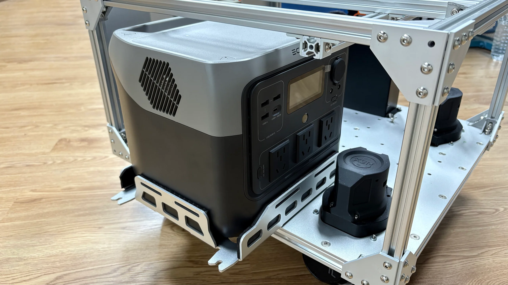</td>
    <td>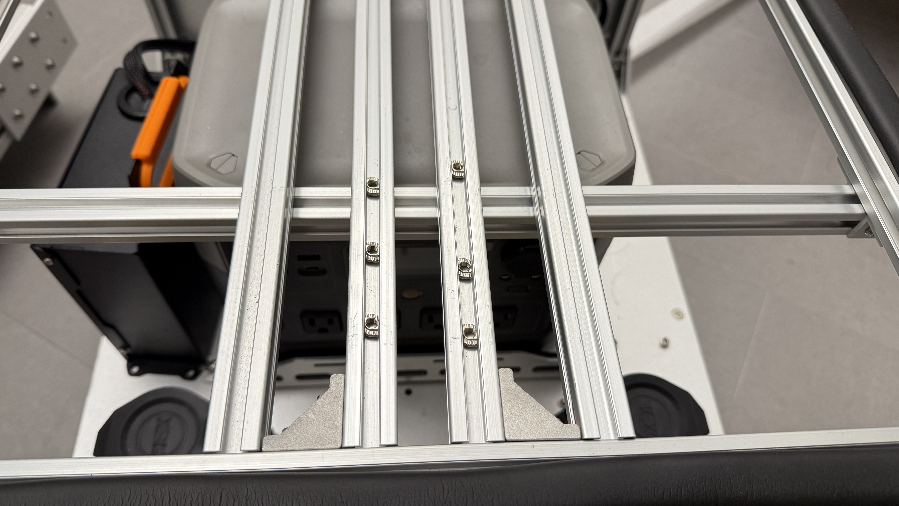</td>
  </tr>
  <tr>
    <td>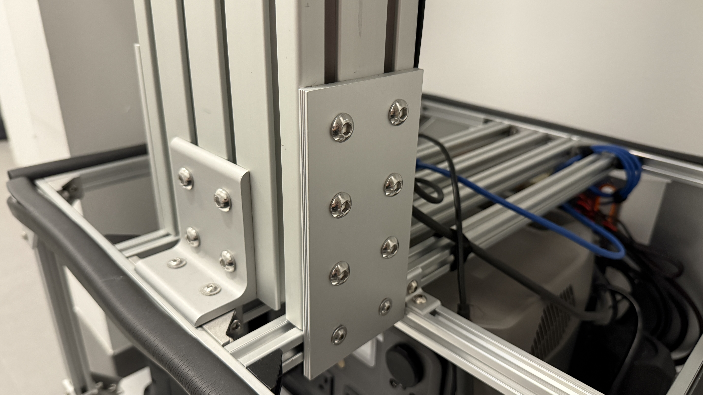</td>
    <td>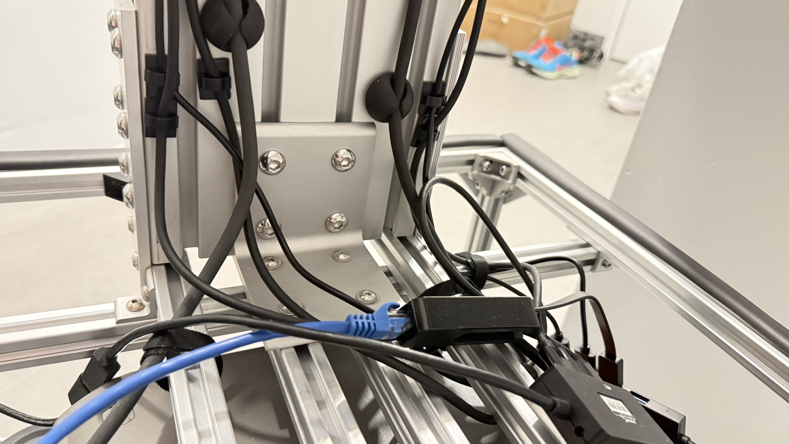</td>
  </tr>
</table>

2. mount two arms

<table align="center">
  <tr>
    <td>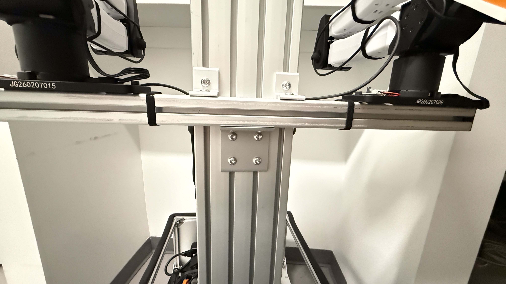</td>
    <td>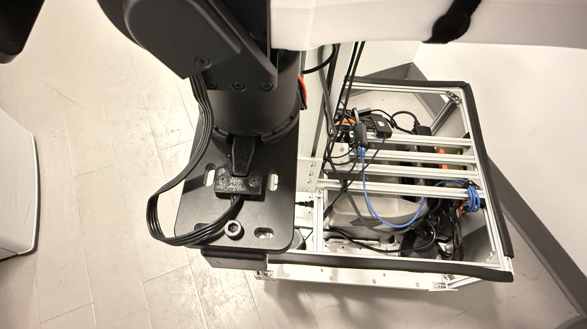</td>
  </tr>
</table>

3. Three camera mounting

<table align="center">
  <tr>
    <td>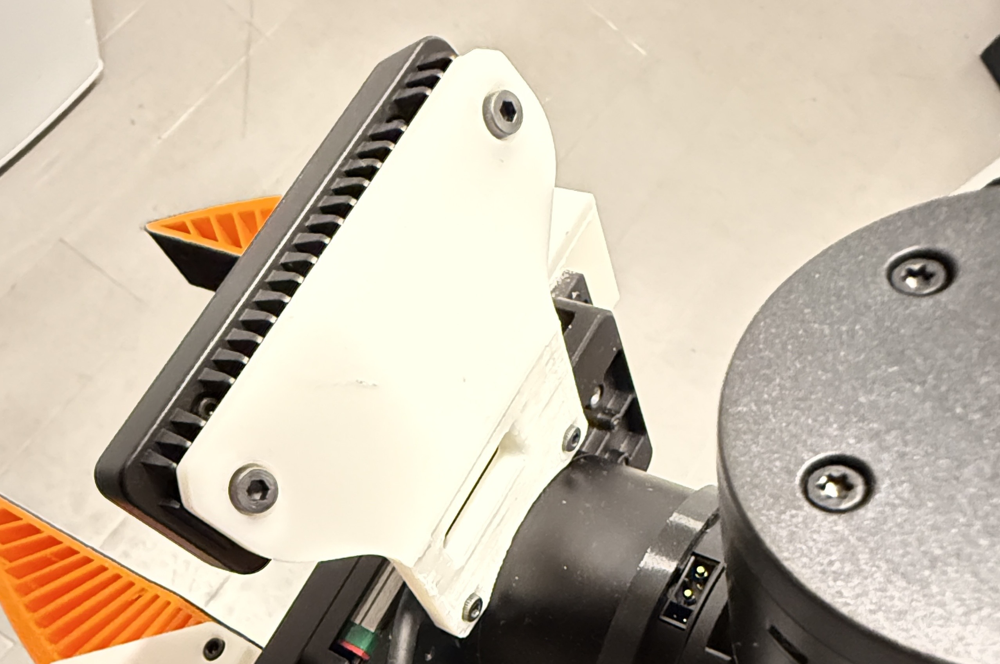</td>
    <td>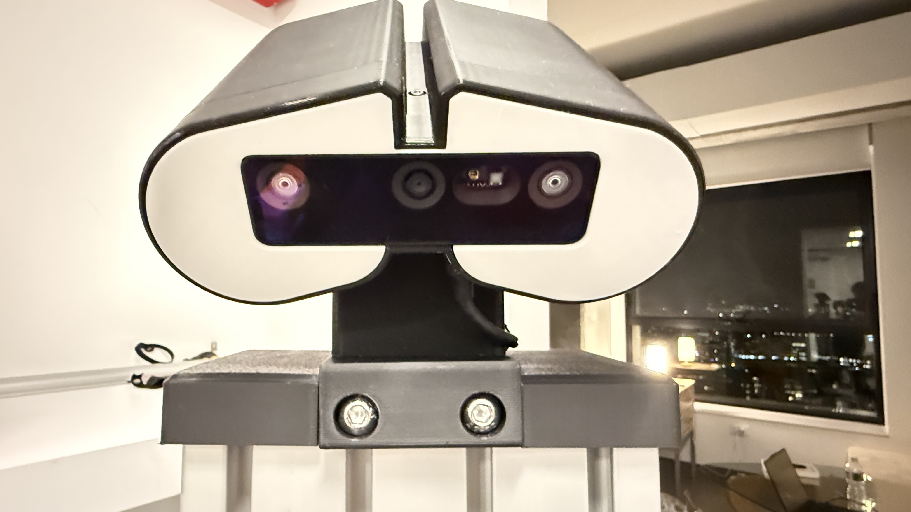</td>
  </tr>
</table>

4. Cable connection: The mobile base connects to the computer via an Ethernet cable, shown as the blue cable. The cameras and robot arms connect to the computer via USB cables. 

<table align="center">
  <tr>
    <td>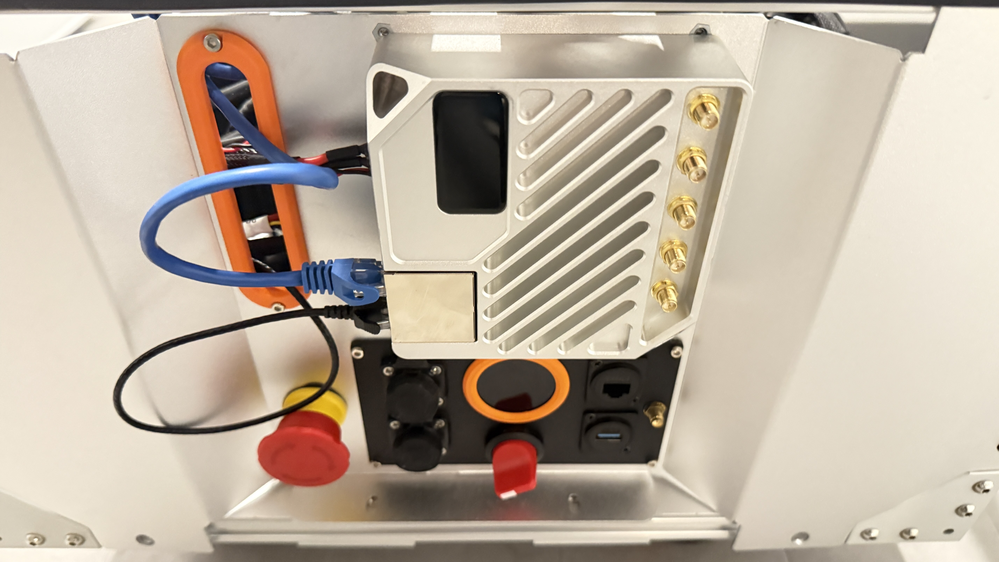</td>
    <td>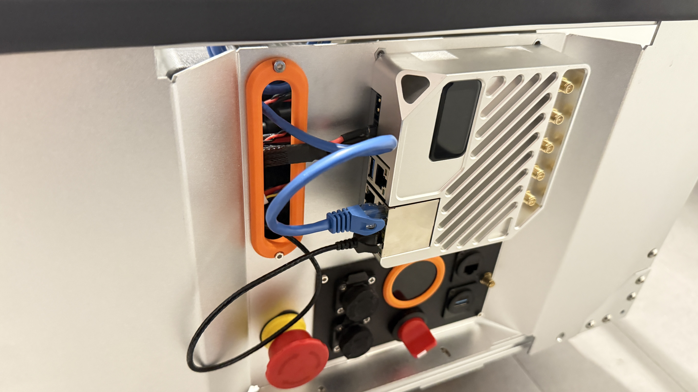</td>
  </tr>
</table>

5. Power system: The arms are powered by the power bank, while the mobile base uses its own battery. For charging, powering the system on/off, and checking the battery status, please refer to the [Hex documentation](https://docs.hexfellow.com/hex-base/maver-l4_en/).
<table align="center">
  <tr>
    <td>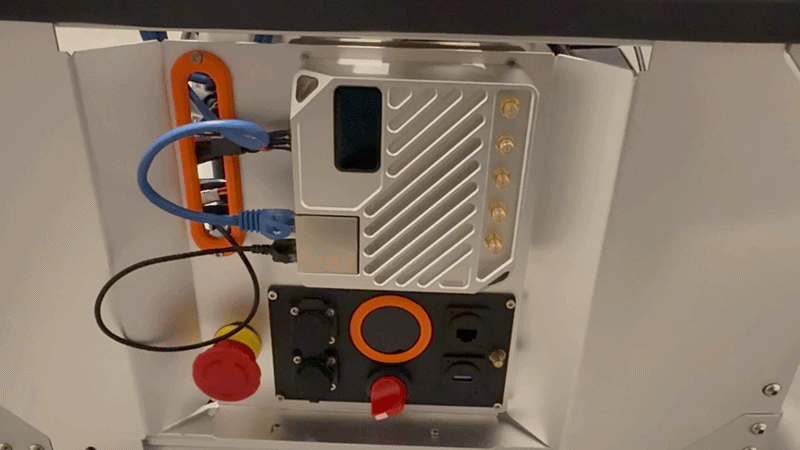</td>
    <td>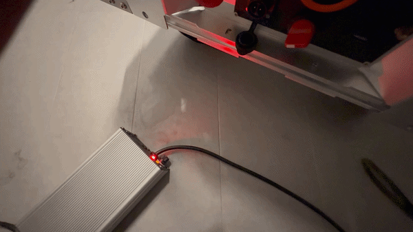</td>
  </tr>
</table>

