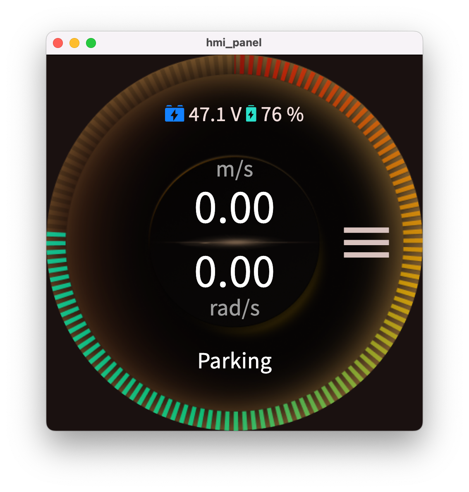
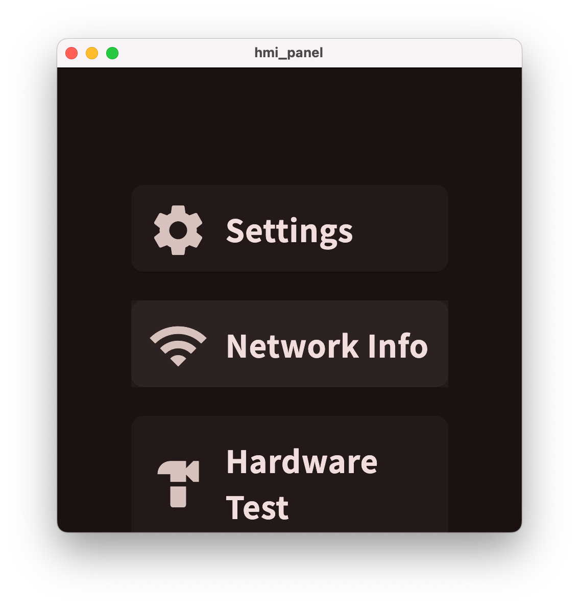
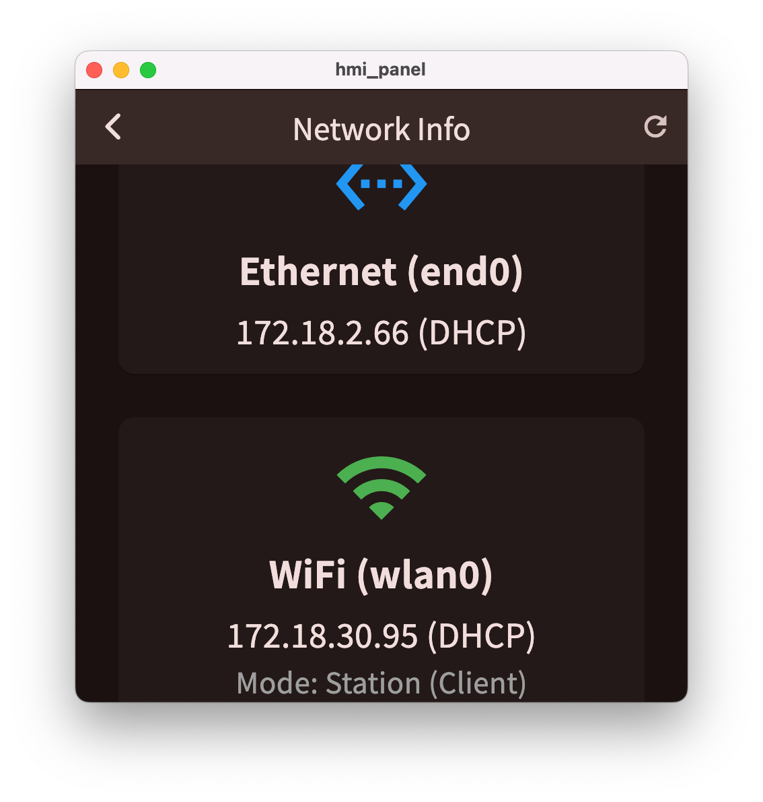

## Policy Rollout


### Installation


Here, we follow [Diffusion Policy](https://github.com/haoyu-x/diffusion_policy/tree/main?tab=readme-ov-file#%EF%B8%8F-installation) to set up the required dependencies for policy training. 
We recommend [Mambaforge](https://github.com/conda-forge/miniforge#mambaforge) instead of the standard anaconda distribution for faster installation: 

```bash
# if you haven't install ``robodiff`` env

sudo apt install -y libosmesa6-dev libgl1-mesa-glx libglfw3 patchelf
cd ~/simple-mobile/diffusion_policy
mamba env create -f conda_environment.yaml
```

```bash
conda activate robodiff
cd ~/simple-mobile/simple_mobile/i2rt
pip install -e .
```
```bash
conda activate robodiff
cd ~/simple-mobile/simple_mobile/pyroki
pip install -e .
```


### Checkpoint:

```bash
# put your checkpoint under here:
cd ~/simple-mobile/diffusion_policy/data
```


```bash
# or download an example one:

conda activate robodiff
mkdir ~/simple-mobile/diffusion_policy/data
cd ~/simple-mobile/diffusion_policy/data
# task: Pick up Black Pepper Grinder
gdown 1o9YVHSZzBhT6IbxRqvTZ2VV526AkIyH6
```

### YAM arms CAN setup

> [!NOTE]
> 1. Remeber to power on the robot arms first.
> 1. Follow [instructions](https://github.com/haoyu-x/simple-mobile/blob/main/simple_mobile/i2rt/docs/getting-started/hardware-setup.md#persistent-can-ids) to set CAN name to can_follower_r and can_follower_l

Quick CAN connection:
```bash
sudo ip link set can_follower_r up type can bitrate 1000000
sudo ip link set can_follower_l up type can bitrate 1000000

```


Test:
```bash
conda activate robodiff
cd ~/simple-mobile/simple_mobile/i2rt
python i2rt/robots/motor_chain_robot.py --channel can_follower_r --gripper_type linear_4310
```

```bash
conda activate robodiff
cd ~/simple-mobile/simple_mobile/i2rt
python i2rt/robots/motor_chain_robot.py --channel can_follower_l --gripper_type linear_4310
```


### Hex mobile base test

> [!NOTE]
> 1. turn on the power
> 1. make sure that the emergency stop switch is released
> 1. make sure your base is connected with the computer with ethernet cable
> 1. make sure to update the HEX_BASE_URL (find on the screen of the base, shown below) in [constants.py](tidybot2/constants.py) to match the Ethernet IP address of your hex mobile base.

<div align="center" style="display: flex; justify-content: center; align-items: center; gap: 16px; margin: 1.5em 0;">
  
    
  
</div>


Test hex base spin:
```bash
conda activate robodiff
cd ~/simple-mobile/simple_mobile/tidybot2
python test_spin.py
```


### Real-world Deployment:
> [!NOTE]
> 1. Update CAMERA_SERIAL in [constants.py](tidybot2/constants.py). (ignore if you did)
> 1. Download and open the XR Browser app on your iPhone.
> 1. Follow [XR Browser useage](https://tidybot2.github.io/docs/usage/#connecting-the-client)
> 1. We will use one iPhone to start, end episodes, and reset the robot during policy rollouts. Make sure the iPhone is connected to the same Wi-Fi network as the computer.


Open a new tab
```bash
conda activate robodiff
cd ~/simple-mobile/simple_mobile/tidybot2
python hex_base_server.py 
```

open another tab:

```bash
conda activate robodiff
cd ~/simple-mobile/simple_mobile/tidybot2
python yam_server.py --channel can_follower_l --rpc-port 50003
```

open another tab:

```bash
conda activate robodiff
cd ~/simple-mobile/simple_mobile/tidybot2
python yam_server.py --channel can_follower_r --rpc-port 50002
```


open another tab, rollout:
```bash
conda activate robodiff
cd ~/simple-mobile/simple_mobile/tidybot2
python rollout.py --save --max-steps 300 --ckpt-path ../../diffusion_policy/data/epoch\=0500-train_loss\=0.001.ckpt
```
